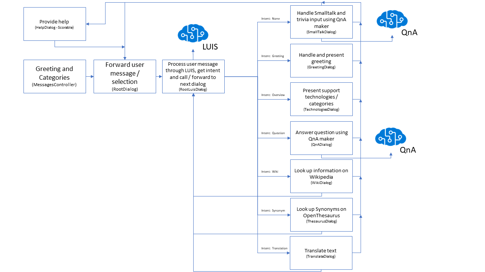

# BotFramework-SupportBot
This project will get you started with an IT support bot, based on the [Microsoft Bot Framework](https://dev.botframework.com) and [QnA maker](https://qnamaker.ai/). The bot will take the user input, do natural language processing to extract the intent of the user and will answer questions through knowledge bases on QnA maker. Additionally the bot uses external services for translation, looking up words on Wikipedia and find German word synonyms on OpenThesaurus (the bot was initially developed for German speaking audiences). The bot also has a scorable (see [documentation](https://ankitbko.github.io/2017/03/human-handover-bot/)) help dialog that can be entered by using the world "help". The following dialogs and dialog flow have been implemented:



## Project Setup

The project uses a few services that need to be set up first. Here is a quick list of things to do. The Visual Studio solution has three projects:
- The actual bot code based on ASP.Net and .Net Framework 4.6
- A small portal to display the user feedback saved by the bot and to add new QnA maker knowledge bases to the bot. This project is a ASP.Net project based on .Net Core 2.0
- A .Net Standard 2.0 library used to maintain the shared models of the two other projects
- Please first check if you have got the lasted version of the used NuGet packages installed. If not, please update at least the Bot Builder SDK to the latest 3.X version

The projects use Entity Framework (Core) for OR mapping and database connection.

### LUIS 
- Sign Up for Cognitive Services Language Understanding Intelligent Service (LUIS) for natural language understanding capabilities on http://luis.ai or http://eu.luis.ai (for European datacenter regions)
- Create a project and create the required intents. You can import a LUIS model with all intents using the files in the LUIS folder. The files for the German model also have some sample utterances with intent mapping. Please note that you need a separate LUIS project for each language if you want to support that. Multi language support is currently not implemented in the project.
- LUIS comes with some free usage, but you might need to get a [key through your Azure subscription](https://docs.microsoft.com/en-us/azure/cognitive-services/LUIS/AzureIbizaSubscription).
- Enter a few utterances for each intent and train your model
- Publish you model and insert your LUIS App ID and subscription key into the attribute of the LUIS dialog class. Make sure the correct region is used (Europe, US, etc.)

### Azure SQL Database
- The project needs a database for maintaining information about QnA maker knowledge bases and to save logs and feedback.
- If you don't have a SQL database (Microsoft SQL Server or Azure SQL Database) accessible for your bot application create a new Azure SQL database server and database.
- To access the Azure SQL database from your local machine or from Visual Studio while debugging don't forget adding your current IP address to the firewall settings of your Azure SQL database server
- Insert your connection string Web.config of the SupportBot.Bot project and the appsettings.json of the SupportBot.Portal project
- You could also inject the database connection strings through your web server. If you are using Azure web apps, you can easily do that through the Settings of your web app.

### Azure App Services Web Apps
- You will eventually need a Web Server supporting ASP.Net and ASP.Net Core to host the two web apps (the bot and the portal).
- If you don't have a server at hand, just [create an Azure App Service Plan](https://docs.microsoft.com/en-us/azure/app-service/app-service-web-get-started-dotnet) with two Web Apps for hosting.
- Azure App Service has authentication build in to secure your portal. You can find more information on that topic in the [Azure docs](https://docs.microsoft.com/en-us/azure/app-service/app-service-authentication-overview).
- Your server will have to support https, Azure Web Apps supports that

### Creating the database tables using Entity Framework
- Make sure you have entered the connection string for you SQL database into the web.config and appsettings.json
- The portal for the bot is developed based on .Net Core and uses Entity Framework Core, the Bot itself is based on .Net Framework and uses Entity Framework
- Find more information about [Entity Framework Core in the documentation](https://docs.microsoft.com/en-us/ef/core/get-started/aspnetcore/new-db)
- Switch to the Package Manager Console and make sure the default project is set to SupportBot.Portal
- If using Azure SQL Database check the firewall settings of your database server to allow access from your development machine
- Create your first migration for the database setup using ```Add-Migration InitialCreate```
- Run ```Update-Database``` to create your database tables
- You can make sure your database tables have been created by using Server Explorer in Visual Studio
## Create your QnA maker knowledge bases
- Sign-on for [QnA maker](https://qnamaker.ai/) and create your knowledge bases / service. You will need one service for handling small talk like "How old are you" and one service for each topic / field of knowledge your boot should support
### Add your QnA maker services to your bot
- With the portal project set as the start project launch the application from Visual Studio and navigate to "Manage Services"
- This is where you can add your [QnA maker](https://qnamaker.ai/) services for topics / technologies your bot will support. You will need the ID for the service, a subscription key and a name the bot will use to present that knowledge base to the user. You will also need the base address for your service, which specifies the location and API version. Currently the bot works with V2.0 of QnA maker API. Please add a tailing '```/```' to the ```BaseAddress```
- You will find this information QnA maker site after publishing you QnA maker service. The ID can be found in the POST url (/knowledgebases/**e25bbb2c-61b4-9862-806b-e3d626e9274f**/generateAnswer), the key right below. You can also click on you name in the QnA maker portal and select "Subscription Keys".
- Enter the information for your Smalltalk service into the ```SmallTalkDialog.cs``` file of the bot project. This is currently hardcoded here as it is not changed that frequently.

### Use the translation dialog
- If you want to offer your users translation services through you bot, you will have to get a Bing Translator key through your Azure Subsciption and add it to your TranslateDialog.cs file. Currently the key is saved in the source.

### Run you bot locally and test it with the bot framework emulator
- Get the [Bot Framework Emulator](https://github.com/Microsoft/BotFramework-Emulator) and install it
- Make the SupportBot.Bot project the start project and run it locally from Visual Studio
- Use the local address for your bot like ```http://localhost:3979/``` and append ```api/messages``` for the endpoint for your bot. 
- Try your bot with the emulator

### Publish your bot on the web
- You need to publish your bot on the web to connect it to different channels (like Web Chat, Skype, Facebook Messenger) through the [Bot Framework Connector](https://dev.botframework.com)
- If you created an Azure Web App earlier, you can use that and publish right from Visual Studio
- If you want to test your published bot with the Emulator you will have to set up a tunnel via [ngrok](https://ngrok.com/). You can set up the tunnel right from the "App Setting" menu of the emulator 
- You can, but you don't have to publish the portal. If you publish it, you will need to secure it

### Register your bot with the Bot Framework Connector
- Sign-up on the [Bot Framework](https://dev.botframework.com) site and create your bot
- Click on "Create" and then "Create a bot with the Bot Builder SDK". Then select "Register an existing bot built using Bot Builder SDK"
- Enter the required information like name, description and handle. When asked for the URL of your bot enter the url starting with ```https``` and ending with ```api/messages```
- Click on the button to create a MS App Id and Password. Take note of the values as they will be used to secure your bot in the next step

### Secure and republish your bot
- Enter the Bot ID and Password into the Web.Config the bot project and republish the Bot to your webserver. Now only the bot channel connector and people who know your secrets can communicate with the bot.

### Test your bot and Add channels
- You can now test your bot right on the bot framework portal and  add new channel here.
- If you want to include the bot into your website or intranet, have a look at the [Web Chat project on Github](https://github.com/Microsoft/BotFramework-WebChat) or the [Skype Web Control](https://dev.skype.com/webcontrol).


